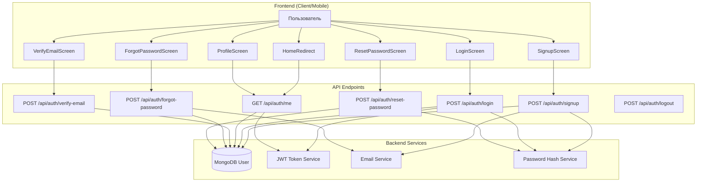
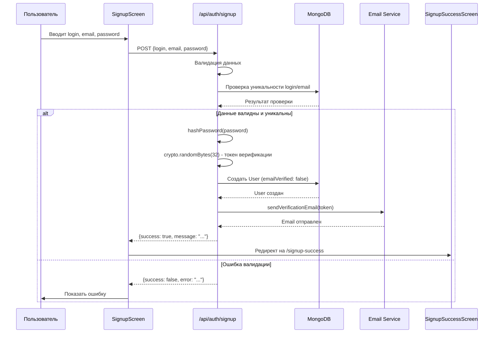
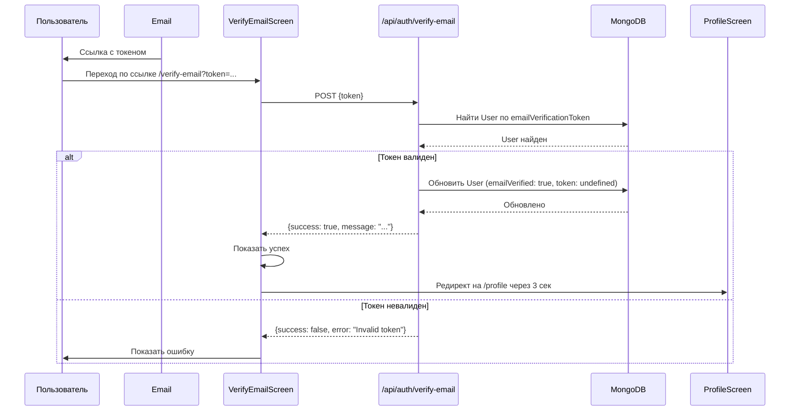
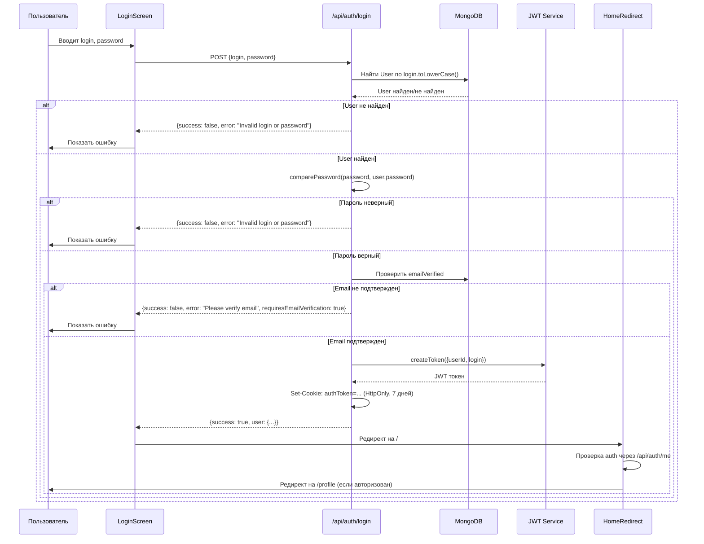
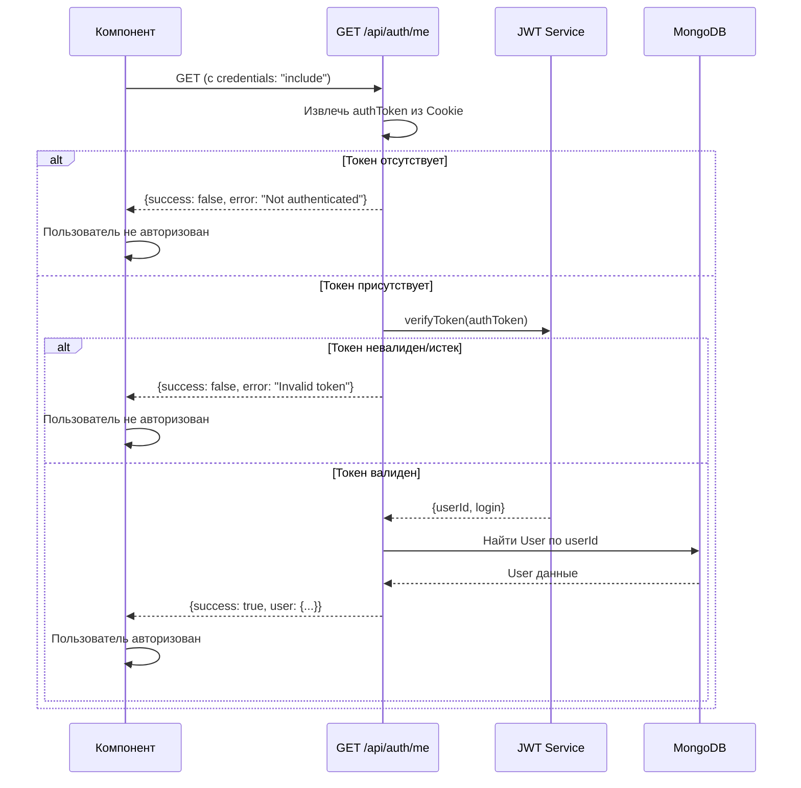
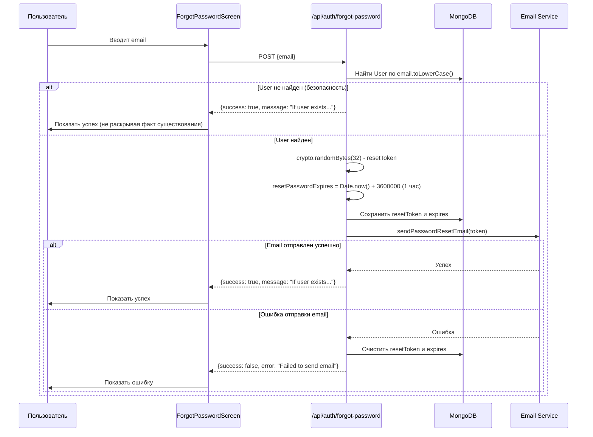
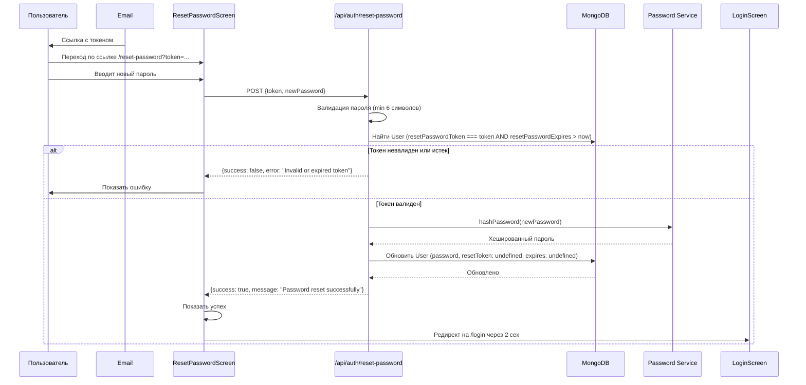
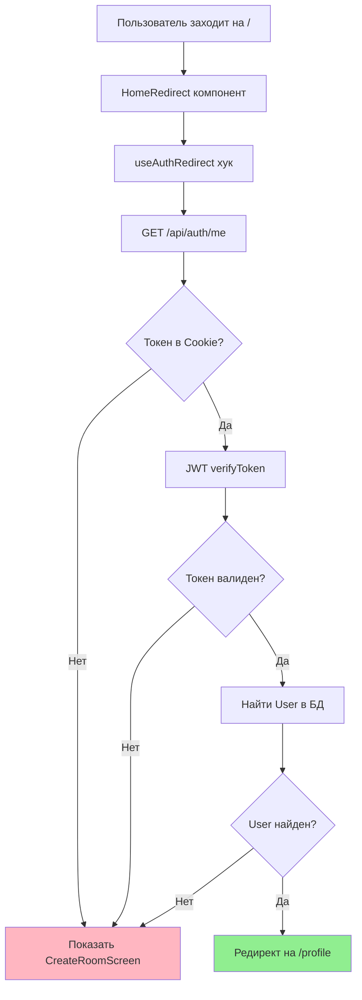
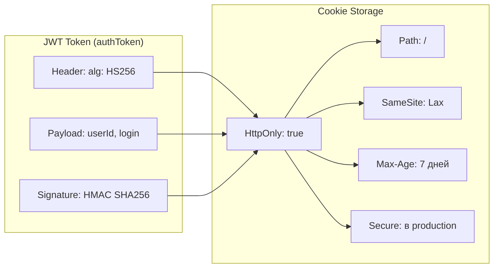
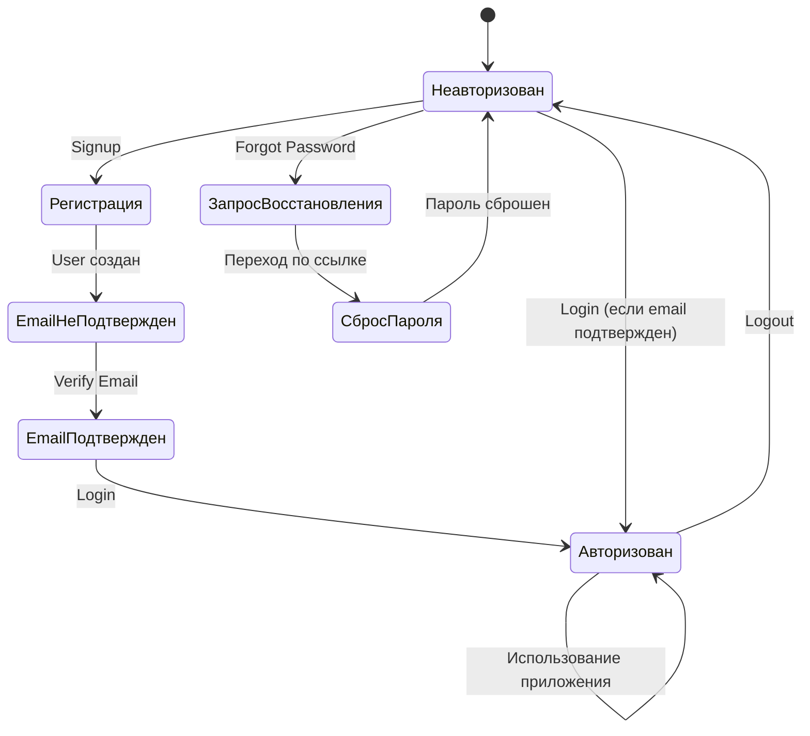

# Схема авторизации в Chesson

## Общая архитектура

## Процесс регистрации (Signup)

## Процесс верификации email

## Процесс входа (Login)

## Проверка авторизации (auth/me)

## Процесс восстановления пароля

## Процесс сброса пароля

## Защита маршрутов (HomeRedirect)

## Хранение токенов

## Состояния пользователя

## API Endpoints Summary

| Endpoint | Method | Описание | Требует Auth |
|----------|--------|----------|--------------|
| `/api/auth/signup` | POST | Регистрация нового пользователя | ❌ |
| `/api/auth/login` | POST | Вход в систему | ❌ |
| `/api/auth/me` | GET | Проверка текущего пользователя | ✅ (Cookie) |
| `/api/auth/verify-email` | POST | Подтверждение email | ❌ |
| `/api/auth/forgot-password` | POST | Запрос на восстановление пароля | ❌ |
| `/api/auth/reset-password` | POST | Сброс пароля с токеном | ❌ |
| `/api/auth/logout` | POST | Выход из системы | ✅ (Cookie) |
| `/api/auth/profile` | PUT | Обновление профиля | ✅ (Cookie) |

## Безопасность

1. **Пароли**: Хранятся в хешированном виде (bcrypt, 10 rounds)
2. **JWT токены**: Подписываются секретным ключом, срок действия 7 дней
3. **Cookies**: HttpOnly, SameSite=Lax, Secure в production
4. **Email верификация**: Обязательна перед входом
5. **Токены восстановления**: Действительны 1 час, одноразовые
6. **Защита от перечисления**: При forgot-password всегда одинаковый ответ
